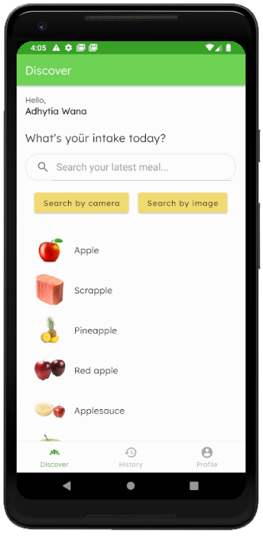
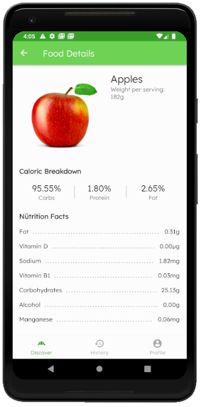
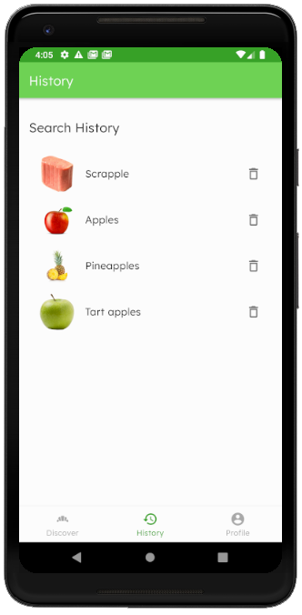

# fÜdery
Smart Nutrition Assistant to manage your daily food intake.

<a href="https://play.google.com/store/apps/details?id=bangkit.xaplose.fudery" title="Get it on Google Play"></a>
#### <a href="https://play.google.com/store/apps/details?id=bangkit.xaplose.fudery" ><b>Download here</b></a>

## Author
#### Xaplose Team - B21-CAP0132  
1. Muhamad Adhytia Wana Putra - A0101029  
2. Ronaldi Tjaidianto - A0101031  
3. Aji Inisti Udma Wijaya - M0101028  
4. Dea Damarista Tarigan - M0090924  
5. Annisa Alvionita - C0050384  
6. Fitrandi Rahayu - C3122783  

## Local Setup
* Clone this repository
```cmd
git clone https://github.com/Xaplose/fudery.git
```
* Open this project through Android Studio (recommended)
* Wait for gradle to build project
* Run on AVD or Real Devices

## Screenshots
[](screenshot/Screenshot_0.png)
[](screenshot/Screenshot_1.png)
[](screenshot/Screenshot_2.png)
[](screenshot/Screenshot_3.png)
[](screenshot/Screenshot_4.png)
